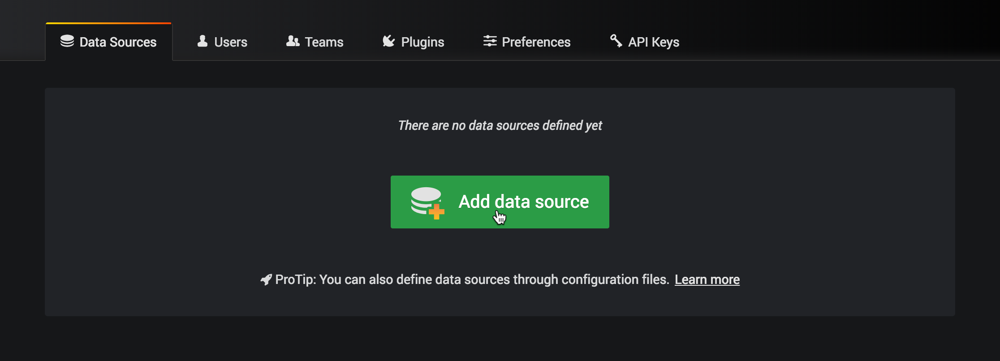

# 1 . grafana+prometheus+node_exporter

<!-- 官网链接 -->
[grafana_labs]: https://grafana.com/grafana/

[prometheus]: https://prometheus.io/

[node_exporter git]: https://github.com/prometheus/node_exporter/releases/

[grafana_install]: https://grafana.com/docs/installation/

<!-- 具体本地链接 -->

[grafana_url]: http://localhost:3000

[prometheus_url]: http://localhost:9090

<!-- 下一篇链接 -->

[grafana+pgsql监控信息]: =。=

###### 本文对应版本：

<font size = 1>
grafana Version 6.5.1 November 28, 2019<br/>
prometheus 2.14.0 / 2019-11-11<br/>
node_exporter 0.17.0 / 2018-11-30 (node_exporter选择了当前稳定版本)
</font>
<!-- h5 err-->

* * *

#### 官网

[grafana_labs] 自定义监控看板系统<br/>
[prometheus] 时序数据库自带检测指标<br/>
[node_exporter git] 监测基础服务器信息指标插件<br/>

## 1.安装

### grafana install

> [grafana_install] 官网安装教程写的非常详细<br/>mac端建议使用brew安装效率比较高 ruby->brew->grafana

```shell
brew services start grafana # 启动 grafana
```

默认端口为3000<br/>
localhost:3000登录grafana 初始密码admin:admin

### prometheus install

从官网下载tar包

```shell
tar -zxvf xx.tar.gz
nohup ./prometheus & # 挂起
```

默认端口为9090<br/>
配置文件prometheus.yml

### node_exporter install

从github下载tar包

```shell
tar -zxvf xx.tar.gz
nohup ./node_exporter & # 挂起
```

默认端口为9100<br/>

* * *

## 2.配置

通过配置prometheus.yml使prometheus监控node_exporter回传时序数据

```yml
scrape_configs:
  # The job name is added as a label `job=<job_name>` to any timeseries scraped from this config.
  - job_name: 'prometheus'

    # metrics_path defaults to '/metrics'
    # scheme defaults to 'http'.

    static_configs:
    - targets: ['localhost:9090']
  - job_name: 'node_exporter'
    static_configs:
      - targets:
        - 'ip1:9100'
        - 'ip2:9100'
        # 写下所有需要监控并且已经部署node_exporter的ip
```

重启prometheus后登陆[prometheus_url]<br/>
此时prometheus的Graph中就会查询到node的参数<br/>
prometheus自带监控功能

* * *

## 3.添加仪表盘

登录[grafana_url]<br/>
在准备好prometheus数据后可以开始利用grafana建立监控dashboard<br/>
<br/>

<br/>
<br/>

-   选择添加数据源<br/>

当然这里我们选择的是Prometheus时序数据库<br/>

-   填写参数并保存<br/>

具体参数获取详情可以点击参数右侧!<br/>
同时在settings右侧的Dashboards中  可以选择系统推荐的几款仪表盘直接进行导入<br/>
配置好后保存测试成功，则添加数据源成功


-   创建dashboard<br/>

官网贴心准备了仪表盘学习视频作为[入门教学](https://www.youtube.com/watch?v=sKNZMtoSHN4&index=7&list=PLDGkOdUX1Ujo3wHw9-z5Vo12YLqXRjzg2)<br/>
这里作为推荐的是推荐较多的 服务器监控dashboard<br/>

> [1 Node Exporter for Prometheus Dashboard English Version UPDATE 1102](https://grafana.com/grafana/dashboards/11074)

-   导入<br/>

生成监控机器的主机信息监控仪表盘<br/>


当然你也可以从 下列官网 挑选 不同的样式 用来一键生成自己喜欢的对应db仪表盘

> <https://grafana.com/grafana/dashboards>

下一篇:[grafana+pgsql监控信息]
